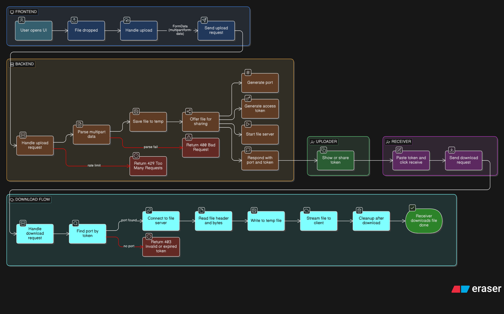
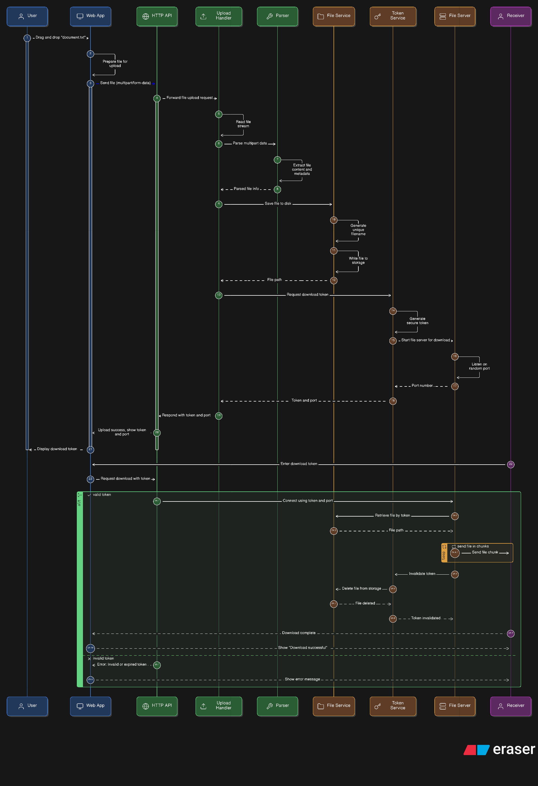

# 🔗 Node To Node - Secure N2N File Sharing

A modern, secure node-2-node file sharing application built with Java (backend) and Next.js (frontend). Share files directly between users with PIN-based authentication and enterprise-grade security features.


<div align="center">
  
  
  
  
  
  
  
  

  
  
  
  

  
  
  
  
  
  
  
  
</div>

---

## ✨ Features

- **🔐 PIN-Based Authentication**: Each upload generates a unique 6-digit PIN for secure access
- **⚡ Real-Time N2N Transfer**: Direct file transfer between nodes without centralized storage
- **📁 Multiple File Types**: Support for documents, images, PDFs, and archives
- **🛡️ Enterprise Security**: Rate limiting, file validation, and timeout protection
- **🎨 Modern UI**: Clean, responsive interface built with React and Tailwind CSS
- **🚀 Fast & Lightweight**: Minimal dependencies, optimized for performance
- **📊 File Size Control**: 100MB upload limit with streaming validation
- **🔒 Thread-Safe**: Concurrent request handling with proper synchronization

---

## 🏗️ Architecture & Concepts

### **1. Node-to-Node  Architecture**

n2n implements a hybrid  model:
- **Central Coordinator**: Backend server manages file metadata and authentication
- **Direct Transfer**: Actual file data flows directly between nodes via TCP sockets
- **Dynamic Ports**: Each file sharing session uses a unique, randomly assigned port



### **2. Multi-Layered Security**

**Defense in Depth Approach:**
1. **Network Layer**: Port validation (1024-65535), socket timeouts
2. **Application Layer**: Rate limiting, content-type validation
3. **Authentication Layer**: PIN-based access control
4. **Data Layer**: File size limits, sanitization

### **3. Concurrent Request Handling**

- **ConcurrentHashMap**: Thread-safe storage for file metadata and tokens
- **ExecutorService**: Thread pool for handling multiple simultaneous requests
- **Atomic Operations**: Race-condition-free counter updates for rate limiting

### **4. Streaming Architecture**

Files are processed using **streaming** rather than loading entirely into memory:
- 8KB buffer for efficient data transfer
- Real-time size validation during upload
- Memory footprint independent of file size

### **5. RESTful API Design**

Clean, stateless API endpoints following REST principles:
- `POST /api/upload` - Upload file and receive PIN
- `GET /api/download?token={PIN}` - Download file with PIN authentication

---

## 🛠️ Technology Stack

### **Backend**
- **Java 17**: Modern Java features including records, text blocks, var
- **HTTP Server**: Built-in `com.sun.net.httpserver` for lightweight HTTP handling
- **Maven**: Dependency management and build automation
- **Apache Commons IO**: Stream utilities for efficient file handling

### **Frontend**
- **Next.js 14**: React framework with server-side rendering
- **TypeScript**: Type-safe JavaScript for better developer experience
- **Tailwind CSS**: Utility-first CSS framework for rapid UI development
- **Axios**: HTTP client for API communication
- **React Icons**: Modern icon library

---

## 🔒 Security Features

### **1. Rate Limiting**
- **10 uploads per IP per minute**
- Sliding window algorithm with automatic reset
- HTTP 429 (Too Many Requests) response for violations

### **2. File Validation (Optional)**
**Allowed Extensions**: `.txt`, `.pdf`, `.jpg`, `.jpeg`, `.png`, `.gif`, `.zip`, `.doc`, `.docx`, `.csv`

**Blocked**: Executables (`.exe`, `.sh`, `.bat`), scripts (`.js`, `.php`, `.py`)

### **3. Size Limits**
- Maximum file size: **100MB**
- Three-layer validation:
  1. Content-Length header check
  2. Streaming size validation
  3. Post-parse content verification

### **4. Access Control**
- **6-digit PIN** (100,000 - 999,999 combinations)
- Token required for every download attempt
- HTTP 403 (Forbidden) for invalid tokens

### **5. Resource Protection**
- **30-second socket timeout** prevents hanging connections
- Automatic cleanup of temporary files (even on errors)
- Port range restriction (1024-65535) blocks system ports

### **6. Thread Safety**
- `ConcurrentHashMap` for shared state
- `AtomicInteger` for lock-free counters
- No race conditions in concurrent operations

### **7. Data Flow**


---

## 🚀 Getting Started

### **Prerequisites**
- Java 17 or higher
- Node.js 18+ and npm
- Maven 3.9+

### **Installation**

1. **Clone the repository**
   ```bash
   git clone https://github.com/yourusername/n2n.git
   cd n2n
   ```

2. **Build the backend**
   ```bash
   mvn clean package
   ```

3. **Install frontend dependencies**
   ```bash
   cd ui
   npm install
   ```

### **Running Locally**

Terminal 1 (Backend):
```bash
java -cp target/n2n-1.0-SNAPSHOT.jar org.harsh.App
```

Terminal 2 (Frontend):
```bash
cd ui
npm run dev
```

Open [http://localhost:3000](http://localhost:3000) in your browser.

---

## 💡 How It Works

### **Upload Flow**

1. User selects a file in the UI
2. Frontend sends multipart form data to `/api/upload`
3. Backend validates file type, size, and rate limit
4. File is saved temporarily with UUID-based filename
5. Backend generates:
   - Random port (1024-65535)
   - 6-digit access PIN
6. Background thread starts TCP server on the assigned port
7. Frontend displays PIN to user

### **Download Flow**

1. User enters 6-digit PIN
2. Frontend sends request to `/api/download?token={PIN}`
3. Backend validates PIN and looks up associated port
4. Backend connects to uploader's TCP server on that port
5. File is streamed through backend to downloader
6. Temporary files are cleaned up automatically

### **Token-Based Authentication**

```java
// Upload: Generate PIN
String token = generateAccessToken(); // "654321"
accessTokens.put(port, token);

// Download: Validate PIN
Integer port = getPortByToken(token);
if (port == null) {
    return 403; // Forbidden
}
```

---

## 📁 Project Structure


```
n2n
├─ DEPLOYMENT.md
├─ Dockerfile.backend
├─ Dockerfile.frontend
├─ PREREQUISITE.md
├─ README.md
├─ docker-compose.yml
├─ nginx.txt
├─ pom.xml
├─ src
│  ├─ main
│  │  └─ java
│  │     └─ org
│  │        └─ harsh
│  │           ├─ App.java
│  │           ├─ controller
│  │           │  └─ FileController.java
│  │           ├─ handler
│  │           │  ├─ CORSHandler.java
│  │           │  ├─ DownloadHandler.java
│  │           │  └─ UploadHandler.java
│  │           ├─ service
│  │           │  └─ FileSharer.java
│  │           └─ utils
│  │              ├─ MultiParser.java
│  │              └─ UploadUtils.java
│  └─ test
│     └─ java
│        └─ org
│           └─ harsh
│              └─ AppTest.java
├─ start.bat
├─ start.sh
├─ ui
│  │  ├─ package.json
│  ├─ components.json
│  ├─ next-env.d.ts
│  ├─ next.config.js
│  ├─ package-lock.json
│  ├─ package.json
│  ├─ postcss.config.js
│  ├─ src
│  │  ├─ app
│  │  │  ├─ favicon.ico
│  │  │  ├─ globals.css
│  │  │  ├─ layout.tsx
│  │  │  └─ page.tsx
│  │  ├─ assets
│  │  ├─ components
│  │  │  ├─ DecryptedText.tsx
│  │  │  ├─ FileDownload.tsx
│  │  │  ├─ FileUpload.tsx
│  │  │  ├─ GradientText.tsx
│  │  │  ├─ InviteCode.tsx
│  │  │  ├─ Lightning.tsx
│  │  │  ├─ Navbar.tsx
│  │  │  └─ ShinyText.tsx
│  │  └─ lib
│  │     └─ utils.ts
│  ├─ tailwind.config.js
│  └─ tsconfig.json
└─ vps-setup.sh

```

---

## 📡 API Documentation

### **POST /api/upload**

Upload a file and receive access credentials.

**Request:**
```http
POST /api/upload HTTP/1.1
Content-Type: multipart/form-data; boundary=----WebKitFormBoundary

------WebKitFormBoundary
Content-Disposition: form-data; name="file"; filename="document.pdf"
Content-Type: application/pdf

[binary data]
------WebKitFormBoundary--
```

**Response:**
```json
{
  "port": 54321,
  "token": "654321"
}
```

**Status Codes:**
- `200 OK` - Upload successful
- `400 Bad Request` - Invalid file type or missing data
- `413 Payload Too Large` - File exceeds 100MB
- `415 Unsupported Media Type` - File type not allowed
- `429 Too Many Requests` - Rate limit exceeded

---

### **GET /api/download?token={PIN}**

Download a file using the access PIN.

**Request:**
```http
GET /api/download?token=654321 HTTP/1.1
```

**Response:**
```http
HTTP/1.1 200 OK
Content-Type: application/octet-stream
Content-Disposition: attachment; filename="document.pdf"

[binary data]
```

**Status Codes:**
- `200 OK` - Download successful
- `403 Forbidden` - Invalid or missing token
- `404 Not Found` - File not found
- `500 Internal Server Error` - Download error

---

## 🎯 Key Concepts Explained

### **1. Why  Instead of Cloud Storage?**

**Advantages:**
- ✅ No server storage costs
- ✅ Direct transfer = faster speeds
- ✅ Files never stored permanently
- ✅ Better privacy (no server retention)

**Trade-offs:**
- ❌ Both nodes must be online
- ❌ Single-use transfers

### **2. Thread-Safe Concurrent Access**

```java
// ❌ NOT Thread-Safe
HashMap<Integer, String> map = new HashMap<>();
map.put(port, file); // Race condition!

// ✅ Thread-Safe
ConcurrentHashMap<Integer, String> map = new ConcurrentHashMap<>();
map.put(port, file); // Atomic operation
```

### **3. Streaming vs Loading**

```java
// ❌ Memory-intensive (loads entire file)
byte[] fileData = Files.readAllBytes(path);

// ✅ Memory-efficient (8KB chunks)
byte[] buffer = new byte[8192];
while ((bytesRead = input.read(buffer)) != -1) {
    output.write(buffer, 0, bytesRead);
}
```

### **4. Defense in Depth**

Multiple security layers ensure that if one fails, others still protect:

```
User Request
    ↓
[Rate Limiter]     ← Layer 1: Prevent spam
    ↓
[File Validator]   ← Layer 2: Block malicious files
    ↓
[Size Checker]     ← Layer 3: Prevent DoS
    ↓
[PIN Validator]    ← Layer 4: Authentication
    ↓
File Transfer
```


----

-- Harsh Shukla
<div align="center">
<a href="https://github.com/hrshshukla" target="_blank">
  
   <a href="https://x.com/hrshshukla" target="_blank">
  </a>
</div>